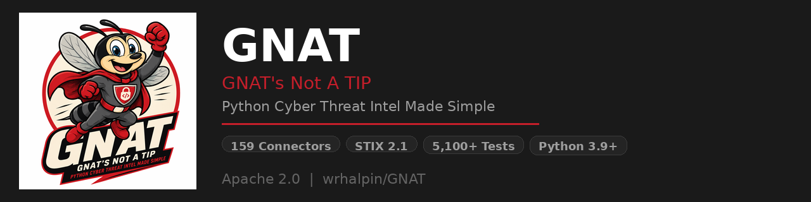

<p align="center">
  
</p>

# GNAT

[](https://python.org)
[](LICENSE)
[](https://github.com/wrhalpin/GNAT/actions/workflows/pylint.yml)
[](#running-tests)
[](pyproject.toml)
[](https://oasis-open.github.io/cti-documentation/stix/intro.html)

A unified Python library for cyber threat intelligence across 159 security
platforms. Every connector implements the same interface and bidirectional
STIX 2.1 translation, making automation portable: switch platforms, add
sources, or replace tools without rewriting pipelines, schedules, or reports.

**Full documentation:** [`docs/`](docs/) — organised by the
[Diataxis](https://diataxis.fr/) framework (tutorials, how-to guides,
reference, explanation). Rendered at
[wrhalpin.github.io/GNAT](https://wrhalpin.github.io/GNAT/).

**Quick starting points:**

- New here? → [tutorials/your-first-rule.md](docs/tutorials/your-first-rule.md)
- Authoring rules? → [how-to/authoring-rules.md](docs/how-to/authoring-rules.md)
- Architecture tour? → [explanation/rule-engine.md](docs/explanation/rule-engine.md)
- Rule engine spec? → [reference/rule-engine-spec.md](docs/reference/rule-engine-spec.md)
- Scheduling feeds? → [how-to/schedule-feeds.md](docs/how-to/schedule-feeds.md)

**Ecosystem:** [SandGNAT](https://github.com/wrhalpin/SandGNAT) · [RedGNAT](https://github.com/wrhalpin/RedGNAT) · [GNAT-gui](https://github.com/wrhalpin/GNAT-gui)

---

## Table of Contents

- [Key Capabilities](#key-capabilities)
- [Supported Platforms](#supported-platforms)
- [Installation](#installation)
- [Quick Start](#quick-start)
- [Core Concepts](#core-concepts)
- [Ingest Pipelines](#ingest-pipelines)
- [Export Pipelines](#export-pipelines)
- [Scheduling](#scheduling)
- [AI Agents & Research Library](#ai-agents--research-library)
- [Natural Language Queries](#natural-language-queries)
- [Sector Targeting Intelligence](#sector-targeting-intelligence)
- [Automated Reports](#automated-reports)
- [Solr Search Sidecar](#solr-search-sidecar)
- [TAXII 2.1 Server](#taxii-21-server)
- [STIX Pattern Validation](#stix-pattern-validation)
- [Multi-Tenant Deployments](#multi-tenant-deployments)
- [Terminal UI & Web Dashboard](#terminal-ui--web-dashboard)
- [Docker & Containerization](#docker--containerization)
- [Connector Capabilities & Code Generation](#connector-capabilities--code-generation)
- [Quality & Security](#quality--security)
- [Project Structure](#project-structure)
- [Development](#development)
- [Architecture](#architecture)
- [License](#license)

---

## Key Capabilities

| Layer | What it does |
|-------|-------------|
| **159 Connectors** | Uniform CRUD + bidirectional STIX 2.1 translation for every supported platform |
| **STIX 2.1 ORM** | Indicator, ThreatActor, Vulnerability, Malware, AttackPattern, Relationship, Observables |
| **Ingest Pipelines** | 15 source readers × 13 mappers; pull from any platform, file, feed, database, or Kafka topic |
| **Export Pipelines** | EDL files, Netskope CE, STIX bundles, CSV; configurable filters + transforms + delivery |
| **FeedScheduler** | Drift-corrected cron scheduling for all job types; APScheduler/Celery adapters |
| **AI Agents** | ResearchAgent (Claude), ParsingAgent (STIX extraction from text), CopilotReader (M365); quality/, security/, and repo_maintenance/ sub-agent packages |
| **NLP Queries** | Natural-language query engine — built-in rule-based or Claude-backed structured extraction |
| **Research Library** | Team knowledge base with staging/curation workflow, TTL management, and deduplication |
| **Automated Reports** | PDF, HTML, DOCX, Markdown; daily/weekly/annual; AI-assisted synthesis; email + SharePoint delivery |
| **Sector Intelligence** | `x_target_sectors` normalized across all connectors with alias expansion and composable filters |
| **Analysis Layer** | NATO Admiralty Scale confidence scoring, TLP 2.0, analyst investigations, cross-platform correlation, timeline reconstruction, evidence graph queries, infrastructure role classification, and LLM-backed gap detection + report drafting |
| **Attribution & Campaigns** | Campaign lifecycle (SUSPECTED → ACTIVE → DORMANT → CONCLUDED), Diamond Model (ACIV), kill-chain progression tracking, competing attribution hypotheses with Admiralty Scale scoring, actor profiles with capability matrices, cluster-to-campaign promotion |
| **Investigation Builder** | Five-step cross-platform evidence graph pipeline (seed → incident expansion → normalise → correlate → materialise) from any combination of connected platforms |
| **HuntGNAT** | STIX pattern → detection rule translation (Sigma, YARA, Suricata, Snort), hunt packages with lifecycle management, ATT&CK coverage matrix, deployment tracking with drift detection, validation scoring |
| **Telemetry Ingestion** | High-volume sensor ingestion from Kafka topics (honeypot, netflow, IDS alert, DNS log); Redis-backed deduplication; automatic campaign linking of ingested indicators |
| **Rule Engine** | Three-engine hypothesis evaluation (Hy/Lisp, YAML declarative DSL, Prolog logic); 26 analyst-authorable helper predicates; priority-based first-match with audit trail; AI-60 confidence ceiling; feature flag OFF by default |
| **Intelligence Reports** | Structured finished-intelligence products with five-state lifecycle (DRAFT → PUBLISHED), STIX 2.1 SDO export on publish, versioning, and attribution |
| **Dissemination** | ExportService (STIX/JSON/PDF), webhook fan-out with HMAC signing, TAXII 2.1 server, bearer-token REST gateway |
| **Solr Search** | Full-text search sidecar; auto-indexes on write; Grafana SimpleJSON dashboards |
| **TAXII 2.1 Server** | Each GNAT workspace exposed as a TAXII 2.1 collection; full protocol compliance |
| **STIX Validator** | Two-tier pattern validator (built-in + ANTLR `stix2-patterns`); ORM `validate=True` opt-in |
| **Multi-Tenant** | Transparent workspace namespace isolation for MSP deployments |
| **Terminal UI** | Textual TUI — works over SSH; NLP query, library browser, scheduler, report viewer |
| **Web Dashboard** | FastAPI SPA — API key auth, rate-limited, research library + reports + scheduler |
| **Docker** | 3-service Compose stack; DevContainer for VS Code/Codespaces; Docker integration test harness |
| **Capability Reflection** | Introspect any connector's methods at runtime; safe guarded dispatch via `call()` |
| **Health Monitoring** | `ConnectorHealthJob` — periodic ping + schema drift detection with Slack/email alerts |
| **XSOAR Pack Generator** | Generate XSOAR 6 content pack zips from any connector via `gnat codegen xsoar` |
| **Contribution Pipeline** | 7-step compliance gate → draft GitHub PR via `gnat contribute` |
| **Rust Extension** | Optional `gnat._core` for hot-path IOC classify/defang/refang/extract_pattern_value |
| **5,100+ Tests** | 70% minimum coverage enforced; Docker integration harness for Elasticsearch + Solr |

---

## Supported Platforms

### Threat Intelligence Platforms

| Key | Platform | Auth |
|-----|----------|------|
| `threatq` | ThreatQ Threat Intelligence Platform | OAuth2 |
| `crowdstrike` | CrowdStrike Falcon | OAuth2 |
| `recordedfuture` | Recorded Future Connect API | API key |
| `alienvault` | AlienVault OTX | API key |
| `virustotal` | VirusTotal | API key |
| `shadowserver` | Shadowserver Foundation | API key |
| `feedly` | Feedly Threat Intelligence | Bearer / API key |
| `threatconnect` | ThreatConnect | OAuth2 / API token |
| `mandiant` | Mandiant Advantage | OAuth2 |
| `defenderti` | Microsoft Defender Threat Intelligence | OAuth2 (Azure AD) |
| `threatstream` | Anomali ThreatStream (OPTIC) | API key + username |
| `socradar` | SOCRadar Extended Threat Intelligence | API key |
| `pulsedive` | Pulsedive | API key |
| `flare` | Flare (Darknet/Threat Exposure Monitoring) | API key |
| `yeti` | YETI (Your Everyday Threat Intelligence) | API key |
| `cloudsek` | CloudSEK Digital Risk Protection | API key |
| `zerofox` | ZeroFox Digital Risk Protection | Bearer |
| `group_ib` | Group-IB Threat Intelligence | API key |
| `cyble_vision` | Cyble Vision | API key |
| `flashpoint` | Flashpoint Underground / Dark Web CTI | Bearer |
| `hudsonrock` | Hudson Rock Breach Intelligence | API key |
| `intel471` | Intel 471 Cybercrime Intelligence | Bearer |
| `misp` | MISP Threat Sharing Platform | API key |
| `opencti` | OpenCTI | API key |
| `hibp` | Have I Been Pwned (HIBP) | API key |
| `synapse` | Vertex Project Synapse | API key / Bearer |
| `osint_feed` | Generic OSINT Feed (TAXII 2.x / STIX-JSON) | None / Basic / API key / Bearer / OAuth2 |
| `mitre_attack` | MITRE ATT&CK (TAXII 2.1) | None (public) |
| `abusech` | Abuse.ch (URLhaus / MalwareBazaar / ThreatFox / Feodo / SSLBL) | Optional Auth-Key |
| `cloudflare_intel` | Cloudflare Threat Intelligence | Bearer token + account_id |
| `cofense_intel` | Cofense Intelligence (human-verified phishing) | HTTP Basic |
| `trm_labs` | TRM Labs (blockchain / crypto intel) | API key (Basic, empty password) |
| `talos` | Cisco Talos Intelligence | None (public reputation) |
| `fortiguard` | Fortinet FortiGuard Labs | Optional Bearer (IOC service) |
| `kaspersky_opentip` | Kaspersky OpenTIP | Optional `x-api-key` |
| `eset_ti` | ESET Threat Intelligence | Bearer token |
| `bitdefender_iz` | Bitdefender IntelliZone | `X-API-Key` header |
| `abuseipdb` | AbuseIPDB community IP reputation | `Key` header |
| `project_honey_pot` | Project Honey Pot http:BL | http:BL access key (DNS-based) |

### SIEMs & Log Analytics

| Key | Platform | Auth |
|-----|----------|------|
| `splunk` | Splunk Enterprise / Splunk ES | Token / Basic |
| `elastic` | Elastic SIEM / Security | API key / Basic |
| `qradar` | IBM QRadar | API token |
| `sentinel` | Microsoft Sentinel | OAuth2 (Azure AD) |
| `graylog` | Graylog | API key / Basic |
| `ossim` | OSSIM / AlienVault SIEM | API key |
| `security_onion` | Security Onion | Bearer |
| `wazuh` | Wazuh SIEM/XDR | API key / Basic |
| `google_chronicle` | Google Chronicle (SecOps SIEM) | Service account / API key |
| `logrhythm` | LogRhythm NextGen SIEM | Bearer / OAuth2 |
| `datadog` | Datadog Cloud SIEM / Security Monitoring | API key + App key |
| `cribl` | Cribl Stream / Edge (Data Pipeline) | Bearer / username+password |

### SOAR & Incident Response

| Key | Platform | Auth |
|-----|----------|------|
| `xsoar` | Palo Alto XSOAR 6 | API key |
| `thehive` | TheHive Security Incident Response | API key |
| `greymatter` | GreyMatter | OAuth2 |
| `servicenow` | ServiceNow ITSM / SecOps | Basic / Bearer |
| `servicenow_secops` | ServiceNow SecOps (SIR + VR + TIARA) | Basic / Bearer |
| `jira` | Atlassian Jira | Basic / Bearer |
| `fortisoar` | Fortinet FortiSOAR | JWT / Basic |

### Network Detection & Response

| Key | Platform | Auth |
|-----|----------|------|
| `snort` | Snort IDS | File / Syslog |
| `suricata` | Suricata IDS/IPS | File / Syslog |
| `zeek` | Zeek Network Monitor | File / Syslog |
| `vectra` | Vectra AI NDR (Network Detection & Response) | API token |
| `extrahop` | ExtraHop Reveal(x) NDR | API key / OAuth2 |
| `darktrace` | Darktrace Enterprise Immune System | HMAC public/private key |
| `nozomi` | Nozomi Networks Guardian / Vantage (OT/IoT) | API token / Basic |
| `dragos` | Dragos Platform (OT/ICS Threat Intelligence) | Basic (API key + secret) |
| `cisco_umbrella` | Cisco Umbrella (Investigate / Enforcement / Management) | Multiple API keys (Investigate, Enforcement, Management) |

### Vulnerability Management

| Key | Platform | Auth |
|-----|----------|------|
| `rapid7` | Rapid7 InsightVM / InsightIDR | API key |
| `nucleus` | Nucleus Security | API key |
| `tenable_one` | Tenable One Exposure Management | X-ApiKeys |
| `qualys` | Qualys VMDR | Basic |
| `greenbone` | Greenbone / OpenVAS | GMP username/password |
| `defectdojo` | DefectDojo Vulnerability Management | API token |
| `osv` | OSV.dev (open-source vulnerabilities) | None (public) |
| `vulncheck` | VulnCheck (exploit intelligence) | Bearer token |

### Cloud Security & ASM

| Key | Platform | Auth |
|-----|----------|------|
| `orca` | Orca Security (Agentless CNAPP) | Bearer |
| `wiz` | Wiz CNAPP | OAuth2 |
| `cortex_xpanse` | Cortex Xpanse (External ASM) | API key |
| `cortex_xdr` | Palo Alto Cortex XDR / XSIAM | API key pair (HMAC-signed) |
| `prisma_cloud` | Palo Alto Prisma Cloud (CSPM/CNAPP) | Access key + secret (JWT) |
| `cycognito` | CyCognito ASM | Bearer |
| `riskrecon` | RiskRecon | OAuth2 |
| `censys` | Censys Internet Intelligence / ASM | API ID + secret |
| `bitsight` | BitSight Security Ratings & Vendor Risk | API token |
| `upguard` | UpGuard Vendor Risk + CAASM + DRP | API key |
| `aws_security` | AWS Security Hub / GuardDuty | AWS SigV4 (access key + secret) |
| `securityscorecard` | SecurityScorecard Security Ratings | API token |
| `jupiterone` | JupiterOne (CAASM / Cyber Asset Graph) | Bearer (API key) |
| `runzero` | runZero (CAASM asset inventory) | Organization Export token (Bearer) |
| `securitytrails` | SecurityTrails (passive DNS / WHOIS history) | API key (`APIKEY` header) |
| `domaintools` | DomainTools Iris (WHOIS / hosting history / pivoting) | API username + API key |
| `silent_push` | Silent Push (future-attack infrastructure) | API key (`X-API-KEY` header) |
| `ip_api` | ip-api.com IP geolocation / enrichment | None (public) |

### Asset & Endpoint Management

| Key | Platform | Auth |
|-----|----------|------|
| `netskope` | Netskope SASE / SSE | API token |
| `controlup` | ControlUp DEX | Bearer |
| `sentinelone` | SentinelOne Singularity XDR | API token |
| `carbon_black` | VMware Carbon Black Cloud | API key + connector ID |
| `armis` | Armis Centrix (IT/OT/IoT) | API secret key |
| `axonius` | Axonius Cybersecurity Asset Management | API key + secret |
| `claroty` | Claroty Platform (OT/IoT) | Username / password |
| `stellarcyber` | Stellar Cyber Open XDR | API key |
| `whistic` | Whistic (Vendor Risk) | API key |
| `proofpoint` | Proofpoint TAP | Basic |
| `trellix` | Trellix XDR / ePolicy Orchestrator (ePO) | OAuth2 |
| `sophos` | Sophos Central (Endpoint + Threat Intelligence) | OAuth2 |
| `lansweeper` | Lansweeper IT Asset Management | OAuth2 / Bearer |
| `fortiedr` | Fortinet FortiEDR | Username / password |
| `fortisiem` | Fortinet FortiSIEM | Username / password |
| `shodan` | Shodan | API key |
| `greynoise` | GreyNoise | API key |
| `cisa` | CISA KEV Catalog (public feed) | None (public) |
| `tanium` | Tanium Endpoint Management & Security | API token / session |
| `trendmicro_visionone` | Trend Micro Vision One XDR | Bearer token |
| `dynatrace` | Dynatrace Observability + App Security | API token |

### Malware Sandboxes & Dynamic Analysis

| Key | Platform | Auth |
|-----|----------|------|
| `joe_sandbox` | Joe Sandbox Cloud (dynamic malware analysis) | API key (form field) |
| `any_run` | ANY.RUN (interactive sandbox) | API key (`API-Key` header) |
| `hybrid_analysis` | Hybrid Analysis / Falcon Sandbox | API key + User-Agent header |
| `vmray` | VMRay (hypervisor-level analysis) | API key (`api_key` header) |
| `intezer` | Intezer Analyze (binary DNA attribution) | API key → JWT Bearer |
| `cuckoo` | Cuckoo Sandbox / CAPEv2 (dynamic malware analysis) | Bearer token |

### Managed Detection & Response (MDR)

| Key | Platform | Auth |
|-----|----------|------|
| `huntress` | Huntress Managed EDR / ITDR | HTTP Basic (key id + secret) |
| `arctic_wolf` | Arctic Wolf MDR | Bearer token (+ optional customer id) |
| `red_canary` | Red Canary MDR | API key (`X-Api-Key` header) |

### Breach & Attack Simulation / Security Validation

| Key | Platform | Auth |
|-----|----------|------|
| `safebreach` | SafeBreach BAS | `x-apitoken` + `x-accountid` headers |
| `attackiq` | AttackIQ Security Optimization | Token header |
| `cymulate` | Cymulate BAS | `x-token` header |
| `picus` | Picus Security Validation | Refresh token → Bearer |
| `pentera` | Pentera automated validation | Bearer (tenant JWT) |
| `xm_cyber` | XM Cyber Attack Path Management | API key → session Bearer |

### Identity Providers & ITDR

| Key | Platform | Auth |
|-----|----------|------|
| `okta` | Okta Identity Cloud | `Authorization: SSWS` |
| `entra_id` | Microsoft Entra ID (Azure AD) | OAuth2 (Microsoft Graph) |
| `ping_identity` | Ping Identity (PingOne) | OAuth2 client credentials |
| `silverfort` | Silverfort (ITDR runtime identity telemetry) | OAuth2 client credentials |
| `semperis` | Semperis DSP (AD / Entra posture + IoE/IoC) | Bearer token |

### Email Security

| Key | Platform | Auth |
|-----|----------|------|
| `mimecast` | Mimecast API 2.0 email security | OAuth2 client credentials |
| `ironscales` | IRONSCALES AI email security | Bearer + `X-Company-Id` header |
| `abnormal` | Abnormal Security (BEC / vendor impersonation) | Bearer token |

### Insider Risk & User Behavior Analytics (UEBA)

| Key | Platform | Auth |
|-----|----------|------|
| `code42` | Code42 Incydr (file exfiltration / insider risk) | OAuth2 client credentials |
| `dtex` | DTEX InTERCEPT (behavioral insider threat) | Bearer token |
| `gurucul` | Gurucul UEBA | Bearer token |
| `exabeam` | Exabeam Security Operations Platform | OAuth2 client credentials |
| `securonix` | Securonix cloud SIEM / UEBA | Username/password → session token |

### DevSecOps & Secrets Detection

| Key | Platform | Auth |
|-----|----------|------|
| `gitguardian` | GitGuardian (secret incidents) | API key (`Authorization: Token`) |

### Real-time Event Intelligence & Crisis Feeds

| Key | Platform | Auth |
|-----|----------|------|
| `dataminr` | Dataminr Pulse (real-time event intelligence) | OAuth2 → `Dmauth` token |
| `factal` | Factal verified breaking-news intelligence | Bearer token |
| `samdesk` | Samdesk global crisis detection | `X-Api-Key` header |
| `human_security` | HUMAN Security (bot defense / ATO / credential stuffing) | OAuth2 client credentials |

### Certificate Transparency

| Key | Platform | Auth |
|-----|----------|------|
| `crtsh` | crt.sh public Certificate Transparency search | None (public) |
| `google_ct` | Google Certificate Transparency log API | None (public; per-log path) |

### Digital Forensics & Incident Response (DFIR)

| Key | Platform | Auth |
|-----|----------|------|
| `velociraptor` | Velociraptor open-source DFIR | Bearer token or mTLS cert/key |
| `magnet_axiom` | Magnet AXIOM Cyber (remote forensics) | `X-API-Key` header |

### Bug Bounty & Vulnerability Disclosure

| Key | Platform | Auth |
|-----|----------|------|
| `hackerone` | HackerOne (bug bounty / VDP) | HTTP Basic (username + token) |
| `bugcrowd` | Bugcrowd (managed bug bounty / pentest) | `Authorization: Token` header |

### GNAT Federation

| Key | Platform | Auth |
|-----|----------|------|
| `gnat_remote` | Remote GNAT instance (federation / workspace sync) | Bearer token |

### AI Assistants & Collaboration

| Key | Platform | Auth |
|-----|----------|------|
| `copilot` | Microsoft Copilot for Security | DirectLine / Bearer |
| `chatgpt` | OpenAI ChatGPT | API key |
| `gemini` | Google Gemini | API key |
| `grok` | Grok AI | API key |
| `discord` | Discord (IOC extraction / CTI notifications/ GNAT command channel) | Bot token |

---

## Installation

```bash
pip install gnat                        # Core — urllib3 transport only
pip install "gnat[yaml]"               # YAML support (pyyaml)
pip install "gnat[taxii]"              # TAXII 2.x reading (taxii2-client)
pip install "gnat[ingest]"             # Full ingest pipeline (taxii2-client + feedparser)
pip install "gnat[async]"              # Async client (httpx)
pip install "gnat[persist]"            # DB persistence (sqlalchemy)
pip install "gnat[schedule]"           # Cron scheduling (croniter)
pip install "gnat[reports]"            # PDF/DOCX reports (reportlab + python-docx)
pip install "gnat[viz]"                # Visualization (plotly, networkx, openpyxl)
pip install "gnat[serve]"              # Web dashboard + TAXII 2.1 server (fastapi, uvicorn)
pip install "gnat[tui]"                # Interactive terminal UI (textual)
pip install "gnat[nlp]"                # NLP query engine (zero deps for builtin; Claude backend requires [agents])
pip install "gnat[stix-validate]"      # Tier-2 STIX pattern validation (stix2-patterns / ANTLR)
pip install "gnat[telemetry]"          # High-volume sensor ingestion (kafka-python-ng + redis)
pip install "gnat[rules]"             # Hy + YAML rule engines for hypothesis evaluation
pip install "gnat[rules-prolog]"     # Prolog rule engine (requires SWI-Prolog)
pip install "gnat[analysis]"           # Attribution & campaign tracking (sqlalchemy)
pip install "gnat[fast]"               # Rust IOC hot-path extension (maturin wheel)
pip install "gnat[all]"                # Core extras (yaml, taxii, ingest, async, persist, schedule, reports, viz, serve)
pip install "gnat[dev]"                # All + ruff, mypy, pytest, httpx, sqlalchemy
```

---

## Quick Start

### 1. Configure

Copy `config/config.ini.example` to `~/.gnat/config.ini`:

```ini
[DEFAULT]
timeout    = 30
verify_ssl = true

[threatq]
host          = https://threatq.example.com
client_id     = my-client-id
client_secret = s3cr3t
auth_type     = oauth2

[crowdstrike]
host          = https://api.crowdstrike.com
client_id     = cs-cid
client_secret = cs-secret
auth_type     = oauth2
```

### 2. Connect and query

```python
import gnat

cli = gnat.GNATClient()
cli.connect(target="threatq")

# Ping — verify connectivity
print(cli.ping())   # True

# List indicators
indicators = cli.list_objects("indicator", limit=50)
for ind in indicators:
    print(ind.name, ind.pattern)
```

### 3. Work with the STIX ORM

```python
# Create
ind = gnat.Indicator(
    client=cli,
    name="Malicious IP",
    pattern="[ipv4-addr:value = '198.51.100.99']",
    indicator_types=["malicious-activity"],
    confidence=85,
)
ind.save()
print(ind.id)  # stix-id assigned by platform after save

# Update
ind.description = "Seen in phishing campaign Q1-2025"
ind.save()

# Delete
ind.delete()

# Other ORM types
actor  = gnat.ThreatActor(client=cli, name="APT-XYZ").save()
malware = gnat.Malware(client=cli, name="BlackCat", is_family=True).save()
vuln   = gnat.Vulnerability(client=cli, name="CVE-2024-12345").save()
rel    = gnat.Relationship(client=cli, relationship_type="uses",
                           source_ref=actor.id, target_ref=malware.id).save()
```

### 4. Switch platforms — zero code changes

```python
cli.connect(target="crowdstrike")   # same ORM calls, different platform
ind = gnat.Indicator(client=cli, name="Evil Hash").save()
```

### 5. Natural-language query

```python
results = cli.natural_language_query(
    "Get all malicious IPs related to Lazarus Group since January"
)
# → list[STIXBase] dispatched to all configured connectors
```

---

## Core Concepts

### STIX 2.1 ORM

Every object from every connector normalises into the same STIX 2.1 types:

| ORM Class | STIX Type | Typical use |
|-----------|-----------|-------------|
| `Indicator` | `indicator` | IOCs with STIX patterns |
| `ThreatActor` | `threat-actor` | Actor profiles, aliases, attribution |
| `Vulnerability` | `vulnerability` | CVEs, CVSS scores, exploited flag |
| `AttackPattern` | `attack-pattern` | MITRE ATT&CK TTPs |
| `Malware` | `malware` | Families, capabilities, kill-chain phases |
| `Relationship` | `relationship` | Links between objects |
| `ObservedData` | `observed-data` | Raw SIEM/sensor observations |

All types inherit from `STIXBase` (`gnat/orm/base.py`) and support:
- `to_dict()` / `from_dict()` / `to_stix_bundle()` — serialisation
- `save()` / `select()` / `delete()` / `refresh()` — platform I/O
- `validate=True` kwarg on `Indicator` — validates pattern before save

### Connector Contract

Every connector implements `BaseClient + ConnectorMixin`:

```python
authenticate()            # set up auth headers/tokens
health_check()            # lightweight connectivity test → bool
get_object(id)            # fetch single object → STIXBase
list_objects(type, ...)   # paginated fetch → list[STIXBase]
upsert_object(stix_obj)   # create or update → id string
delete_object(id)         # delete by id
to_stix(raw_obj)          # platform dict → STIXBase
from_stix(stix_obj)       # STIXBase → platform dict
```

Capabilities are introspectable at runtime:

```python
from gnat.clients import get_client
client = get_client("threatq")
caps = client.capabilities()     # all public methods with signatures and docs
result = client.call("list_objects", stix_type="indicator", allow_write=False)
```

---

## Ingest Pipelines

Pull threat intelligence from any source into STIX 2.1 objects:

```python
import gnat

cli = gnat.GNATClient().connect("threatq")

result = (
    gnat.IngestPipeline("daily-blocklist")
    .read_from(gnat.PlainTextReader("blocklist.txt"))
    .map_with(gnat.FlatIOCMapper(tlp_marking="amber", confidence=75))
    .write_to(cli)
    .deduplicate(key_fields=["name"])
    .filter(lambda o: getattr(o, "confidence", 0) >= 50)
    .run()
)
# IngestResult: 1204 records → 1198 STIX objects, 1102 written
```

**STIX/TAXII feed → CrowdStrike:**

```python
from taxii2client.v21 import Server
server = Server("https://limo.anomali.com/api/v1/taxii2/", user="guest", password="guest")
collection = server.api_roots[0].collections[0]

result = (
    gnat.IngestPipeline("taxii-feed")
    .read_from(gnat.TAXIICollectionReader(collection, stix_types=["indicator"]))
    .map_with(gnat.STIXPassthroughMapper(client=cli))
    .write_to(cli)
    .deduplicate()
    .run()
)
```

**NVD CVE feed → vulnerability tracking:**

```python
result = (
    gnat.IngestPipeline("nvd-daily")
    .read_from(gnat.JSONReader("nvdcve-1.1-recent.json", records_key="CVE_Items"))
    .map_with(gnat.NVDCVEMapper(confidence=95))
    .filter(lambda v: getattr(v, "x_cvss_score", 0) >= 7.0)  # HIGH+ only
    .run()
)
```

### Source Readers (14)

| Reader | Source |
|--------|--------|
| `PlainTextReader` | One IOC per line, auto-classified |
| `CSVReader` | Delimited files with column mapping |
| `JSONReader` / `JSONLReader` | JSON array or NDJSON |
| `STIXBundleReader` | STIX 2.x bundle files |
| `TAXIICollectionReader` | TAXII 2.x collections |
| `SQLReader` | Any DB-API 2.0 database |
| `MISPReader` | MISP event export JSON |
| `SyslogReader` | Syslog / CEF / LEEF logs |
| `RSSReader` | RSS 2.0 / Atom 1.0 feeds |
| `EmailReader` | RFC 2822 `.eml` files |
| `OpenIOCReader` | OpenIOC 1.1 XML |
| `SplunkReader` | Splunk REST Search API |
| `ElasticReader` | Elasticsearch scroll API |

### Mappers (12)

| Mapper | Produces |
|--------|---------|
| `FlatIOCMapper` | `Indicator` |
| `STIXPassthroughMapper` | Any STIX type |
| `MISPAttributeMapper` | `Indicator`, `Vulnerability`, `Malware` |
| `CEFMapper` | `Indicator` |
| `SQLRowMapper` | Configurable |
| `CSVIndicatorMapper` | `Indicator` |
| `RSSEntryMapper` | `Indicator`, `Vulnerability` |
| `EmailIOCMapper` | `Indicator` |
| `OpenIOCMapper` | `Indicator` |
| `SplunkResultMapper` / `ElasticResultMapper` | `Indicator` |
| `NVDCVEMapper` | `Vulnerability` |

---

## Export Pipelines

Push STIX objects to destinations with composable filters, transforms, and delivery targets:

```python
result = (
    gnat.ExportPipeline("tq-to-netskope")
    .read_from(workspace)
    .filter_with(gnat.TypeFilter("indicator"))
    .filter_with(gnat.ConfidenceFilter(min=70))
    .filter_with(gnat.SectorFilter(["healthcare", "financial"]))
    .transform_with(gnat.NetskopeCETransform(
        source_label="ThreatQ",
        ioc_types=["domain", "url", "sha256"],
    ))
    .deliver_to(gnat.PlatformDelivery(netskope_client))
    .run()
)
```

### Filters

| Filter | Purpose |
|--------|---------|
| `TypeFilter` | By STIX object type |
| `ConfidenceFilter` | Minimum confidence threshold |
| `TLPFilter` | By TLP marking (white/green/amber/red) |
| `SectorFilter` | By `x_target_sectors` with alias expansion |
| `IOCTypeFilter` | By IOC type (ip/domain/url/hash/…) |
| `LimitFilter` | Hard cap on object count |

### Delivery Targets

| Target | Description |
|--------|-------------|
| `FileDelivery` | Write to local file |
| `EDLServer` | Serve EDL over HTTP (live-updating indicator lists for firewalls) |
| `PlatformDelivery` | Push to any registered GNAT connector |
| `MultiDelivery` | Fan-out to multiple targets simultaneously |

---

## Scheduling

All job types run in a single `FeedScheduler` with drift-corrected cron scheduling:

```python
from gnat.schedule import FeedScheduler, FeedJob

scheduler = FeedScheduler()

class DailyIngestJob(FeedJob):
    name    = "daily-threatq-ingest"
    cron    = "0 2 * * *"   # 02:00 UTC daily

    def run(self, ctx):
        # ctx.last_success_iso available for incremental ingestion
        pipeline = IngestPipeline("threatq").read_from(...).run()

scheduler.register(DailyIngestJob())
scheduler.start()

# Export + Report jobs use the same scheduler
scheduler.register(ExportJob(...))
scheduler.register(ReportJob(...))
```

Features: overlap protection (skip or queue policy), `on_success`/`on_failure` callbacks,
`ctx.last_success_iso` for incremental reads, `to_cron_lines()` for static crontab export,
APScheduler and Celery adapters for existing infrastructure.

---

## AI Agents & Research Library

### Core AI Agents

| Agent | Role | Backend |
|-------|------|---------|
| `ResearchAgent` | Topic-driven synthesis; feed-driven monitoring | Claude API (`web_search` tool) |
| `ParsingAgent` | Extract STIX objects from unstructured text | Claude API |
| `CopilotReader` | Query M365 content (SharePoint, Teams, mail) via DirectLine | Microsoft Bot Framework |
| `ConnectorHealthJob` | Periodic connector health checks + schema drift detection | Built-in |
| `LLMClient` | Unified LLM facade — Claude, OpenAI, Grok, Gemini with automatic fallback | Multiple |

All AI-extracted objects are capped at `confidence_ceiling = 60` (configurable) and tagged
`x_source_type = "ai_extracted"`. Default export pipelines use `ConfidenceFilter(min=70)`,
ensuring AI intel requires analyst promotion before reaching production EDLs.

```ini
[claude]
api_key            = sk-...
model              = claude-sonnet-4-6
ai_confidence_ceiling = 60
```

### Quality Agents (`gnat/agents/quality/`)

Automated connector assurance pipeline — runs during CI and on-demand:

| Agent | Role |
|-------|------|
| `FixtureCoverageAgent` | Identifies connectors missing test fixtures; generates coverage gap reports |
| `NormalizationRegressionAgent` | Runs golden-fixture regression tests to detect STIX normalization drift |
| `ContractAgent` | Verifies all 8 required `ConnectorMixin` methods are present and correctly typed |

```python
from gnat.agents.quality import NormalizationRegressionAgent, ContractAgent

agent = NormalizationRegressionAgent(policy=RegressionPolicy(fail_on_drift=True))
result = agent.run_all()   # compare against golden fixtures

contract = ContractAgent()
profile = contract.check("crowdstrike")  # ContractCheckResult
```

### Security Agents (`gnat/agents/security/`)

Two sub-packages for runtime secrets management and code hygiene:

**Hygiene** (`gnat/agents/security/hygiene/`):

| Module | Role |
|--------|------|
| `leak_scanner` | Scans connector output for accidental credential/PII leakage |
| `unsafe_patterns` | Detects unsafe coding patterns (hardcoded secrets, bare `except`, etc.) |
| `duplicate_detector` | Flags duplicate connector registrations and conflicting key aliases |

**Secrets Management** (`gnat/agents/security/secrets/`):

| Component | Role |
|-----------|------|
| `SecretsBroker` | Central resolver — dispatches to configured provider (vault, env, INI) |
| `providers/` | Pluggable backends: `AzureKeyVaultProvider`, `CyberArkProvider`, `MemoryProvider` |
| `SecretResolver` | Resolves `${secret:key}` interpolation tokens inside INI config values |
| `SecretsAuditLog` | Immutable append-only log of every secret access for compliance |

### Repository Maintenance Agents (`gnat/agents/repo_maintenance/`)

Automated connector lifecycle management:

| Component | Role |
|-----------|------|
| `DiscoveryEngine` | Scans the connector directory; detects new, modified, or stale connectors |
| `RepairPlanner` | Generates `RepairPlan` (diff-based) for connectors that have drifted from the `ConnectorMixin` contract |
| `VerificationEngine` | Runs post-repair verification checks and produces `VerificationResult` |
| `MaintenanceExecutor` | Orchestrates discovery → repair → verify → PR creation end-to-end |
| `ConnectorRegistry` | Queryable in-memory registry of all `ConnectorSpec` entries with metadata |

### Research Library

Three-tier team knowledge base with controlled promotion:

```
Personal Workspaces  →  Staging (_gnat_staging)  →  Library (_gnat_library)
   analyst-owned         anyone can write              curated, read-only
                         nothing auto-promotes         CurationJob every 4h
```

```python
from gnat.research import ResearchLibrary

lib = ResearchLibrary.default()

# Check freshness before running expensive AI research
if not lib.is_fresh("APT29", max_age_hours=72):
    agent = ResearchAgent(config)
    results = agent.research("APT29 latest TTPs")
    lib.promote(workspace, topic="APT29", researcher="analyst1", note="Q1 2025 update")

# Query the library
entries = lib.search("Cobalt Strike", tlp="amber")
```

`CurationJob` deduplicates entries (most recent wins per topic) and enforces TTLs:
`indicator` → 24 h, `vulnerability` → 72 h, `campaign` → 14 d, `threat_actor` → 30 d.

---

## Natural Language Queries

```python
cli = gnat.GNATClient()

results = cli.natural_language_query(
    "Get all malicious IPs associated with Lazarus Group in the past 30 days"
)
# → list[STIXBase] dispatched to all configured connectors
```

Two backends — configure via `[nlp]` section:

```ini
[nlp]
backend = builtin   # builtin (zero deps) | claude (structured extraction)
model   = claude-sonnet-4-6
```

The **builtin** backend uses regex and keyword rules with zero extra dependencies.
The **claude** backend uses the Claude API for structured `QuerySpec` extraction, supporting
complex entity, IOC-type, time-range, and platform filters.

CLI: `gnat nlq "Show me all CVEs exploited in the wild this week"`

---

## Sector Targeting Intelligence

GNAT normalizes industry/sector data from all connectors into a single canonical field
`x_target_sectors` (list of strings on any STIX object), with platform-specific extraction:

| Platform | Native field | Extraction |
|----------|-------------|------------|
| ThreatQ | `attributes[].name` ∈ sector variants | `_extract_sectors()` |
| Recorded Future | `relatedEntities[type=Industry].entity.name` | JSON path |
| CrowdStrike | `target_industries[]` (adversary objects) | JSON path |
| VirusTotal | `popular_threat_category{}.value` | JSON path |
| ShadowServer | `sector` (top-level report field) | JSON path |
| Nucleus | `asset.industry` + `asset.tags[]` | Combined |

Sector aliases are configured in `[sector_aliases]` and expanded automatically by `SectorFilter`:

```ini
[sector_aliases]
healthcare = Healthcare, Health, Medical, H-ISAC, Hospitals and Health Centers
financial  = Financial Services, Finance, Banking, FS-ISAC
energy     = Energy, Electric, Oil and Gas, E-ISAC
```

`SectorFilter` is a composable `ExportFilter` subclass available as `gnat.export.SectorFilter`
and re-exported from `gnat.reports.base` for backward compatibility.

---

## Automated Reports

Three report types, fully scheduled:

| Type | Schedule | AI | Formats | Audience |
|------|----------|----|---------|----------|
| Daily Intel | `0 6 * * *` | Assisted | PDF, HTML, Markdown | SOC / shift handoff |
| Trends | `0 6 * * 1` | Assisted | PDF, HTML | Team leads |
| Yearly | `0 6 1 1 *` | Full | PDF, DOCX | Management / compliance |

```python
from gnat.reports import ReportGenerator

gen = ReportGenerator.from_config(config)
gen.run("daily_healthcare", formats=["pdf", "html"], output_dir="/var/reports/")
```

Generation pipeline: `DataAggregator` → `ReportSynthesizer` (one Claude call per section) →
`Renderers` (MD/HTML/PDF/DOCX) → `Delivery` (email body-HTML + SharePoint).

CLI: `gnat report list` / `gnat report run --config report.daily_healthcare --formats pdf html`

---

## Solr Search Sidecar

Full-text search across all STIX objects from all connectors simultaneously:

```ini
[search]
solr_url   = http://localhost:8983/solr/gnat
enabled    = true
batch_size = 100
```

| Component | File | Function |
|-----------|------|----------|
| `GNATIndexer` | `gnat/search/index.py` | Add/update/delete Solr documents |
| `SearchMixin` | `gnat/search/mixin.py` | Auto-index on `upsert_object()` — zero connector code change |
| `ORM integration` | `gnat/search/orm_with_mixin.py` | Search-enhanced STIX objects |
| `PipelinePatch` | `gnat/search/pipeline_patch.py` | Route ingest records through Solr post-map |
| `LibraryPatch` | `gnat/search/library_patch.py` | ResearchLibrary cross-source correlation |
| Solr schema | `gnat/search/solr_schema_gnat.xml` | Solr 9.x schema for GNAT fields |

Grafana dashboards via `gnat viz serve --with-solr` or `gnat viz solr-dashboard --file dashboard.json`.

---

## TAXII 2.1 Server

Each GNAT workspace is exposed as a TAXII 2.1 collection:

```bash
gnat taxii --port 8090 --api-key s3cr3t
gnat taxii --title "Acme TAXII" --contact admin@acme.com --port 9000
```

Full endpoint coverage: Discovery, API Root, Collections (list/detail), Objects (GET/POST/paginated),
Manifest, single object, and version history. Requires `gnat[serve]`.

---

## STIX Pattern Validation

Two-tier validator — no dependencies for tier 1:

```python
from gnat.stix import validate_pattern, PatternValidationError

result = validate_pattern("[ipv4-addr:value = '1.2.3.4']")
assert result.valid

validate_pattern("[bad", raise_on_error=True)   # raises PatternValidationError
```

ORM integration (non-breaking, opt-in per object):

```python
from gnat.orm.indicator import Indicator
ind = Indicator(pattern="[ipv4-addr:value = '1.2.3.4']", validate=True)
```

CLI: `gnat validate pattern "[domain-name:value = 'evil.com']"`
`gnat validate bundle indicators.json --strict`  (uses `stix2-patterns` ANTLR if installed)

---

## Multi-Tenant Deployments

Transparent workspace namespace isolation — no schema migration required:

```python
from gnat.context import WorkspaceManager

manager = WorkspaceManager.default()

acme = manager.for_tenant("acme")
ws   = acme.create("apt28-investigation")
# stored as "acme::apt28-investigation"

beta = manager.for_tenant("beta")
ws2  = beta.create("apt28-investigation")
# stored as "beta::apt28-investigation" — no collision
```

CLI: `gnat tenant list` / `gnat tenant create acme --display-name "Acme Corp"` /
`gnat tenant workspaces acme` / `gnat tenant delete acme --yes`

---

## Terminal UI & Web Dashboard

### Terminal UI (Textual)

Works over SSH — no browser, no display server:

```bash
gnat tui            # launch on dashboard screen
gnat tui query      # start directly on NLP query screen
```

Four screens (F1–F4):
- **Query** — NLP search bar + scrollable STIX results table
- **Library** — Research Library browser; promote (Ctrl+P) / reject (Ctrl+X)
- **Scheduler** — Live job status with manual trigger (Ctrl+T)
- **Reports** — PDF/HTML/DOCX browser; open in system browser (Ctrl+O)

Install: `pip install "gnat[tui]"`

### Web Dashboard (FastAPI)

```bash
gnat serve --port 8088 --api-key $(openssl rand -hex 16)
```

Secured by `X-Api-Key` header; binds to `127.0.0.1` by default; rate-limited to 100 req/min.
Embed behind nginx + TLS for external access.

| Route | Purpose |
|-------|---------|
| `GET/POST /api/library` | Research Library search, promote, reject |
| `GET /api/reports` | List reports; serve HTML inline |
| `GET/POST /api/scheduler/jobs` | Job list + manual trigger |
| `GET /health` | Unauthenticated liveness |
| `GET /` | Single-page dashboard (dark theme, no build step) |

Install: `pip install "gnat[serve]"`

---

## Docker & Containerization

### Production stack

```bash
make docker-build && make docker-up           # 3-service stack
docker compose --profile full up -d           # + Solr + Grafana
make docker-logs
```

| Service | Port | Description |
|---------|------|-------------|
| `gnat-scheduler` | — | FeedScheduler: ingest, export, AI, curation, reports |
| `gnat-edl` | 8080 | EDL server for firewall EDL integration |
| `gnat-monitor` | 8090 | Health endpoint + `GET /status` JSON |
| `solr` *(search profile)* | 8983 | Solr full-text search index |
| `grafana` *(monitoring profile)* | 3000 | Grafana dashboards |

Copy `.env.example` to `.env`; set `GNAT_CONFIG_DIR`, `EDL_PORT`, `MONITOR_PORT`.

### VS Code DevContainer

`.devcontainer/devcontainer.json` provides a one-click environment with Rust toolchain,
Docker-in-Docker, and Ruff extension — fully configured for GitHub Codespaces.

### Docker Integration Test Harness

```bash
make test-docker    # start containers → run suite → teardown
```

Spins up Elasticsearch 8.13.4 and Solr 9.6 on non-conflicting ports for reproducible CI
integration tests without live credentials. 48 integration tests across TAXII round-trips,
Elasticsearch, and Solr indexing.

---

## Connector Capabilities & Code Generation

### Capability Reflection

```python
client = get_client("threatq")
caps = client.capabilities()
# → [{name, signature, doc, type: "auth|read|write|helper", platform_specific: bool}, ...]

# Safe guarded dispatch — write methods require explicit allow_write=True
result = client.call("list_objects", stix_type="indicator")
client.call("upsert_object", stix_obj=ind, allow_write=True)
```

CLI:
```bash
gnat client capabilities --platform threatq
gnat client call --platform splunk --method list_objects --args stix_type=indicator
```

### OpenAPI Scaffold

```bash
gnat codegen openapi --spec path/to/openapi.yaml --target myplatform
```

Generates `client.py`, `__init__.py`, and a full pytest scaffold in seconds.

### XSOAR Content Pack Generator

```bash
gnat codegen xsoar --connector threatq --output ./packs/
```

Introspects the connector via `capabilities()`, maps methods to XSOAR command definitions,
and writes a valid XSOAR 6 content pack zip. Write methods are flagged `dangerous: true`.

### Upstream Contribution Pipeline

```bash
gnat contribute --connector myplatform --message "Add MyPlatform connector"
gnat contribute --connector myplatform --dry-run   # compliance check only
```

7-step gate: enabled guard → registry check → compliance matrix (all 8 required methods + tests)
→ full test run → branch creation (`contribute/{platform}-{timestamp}`) → push → draft PR.
`draft_pr = true` is hardcoded; PRs are always created as drafts.

---

## Quality & Security

### Continuous Integration

| Workflow | Trigger | Python versions | Purpose |
|----------|---------|----------------|---------|
| **pylint** | every push | 3.9, 3.10, 3.11, 3.12 | Style and logic analysis |
| **python-tests** | push to `main`, pull requests | 3.11, 3.12, 3.13 | Unit test suite |
| **python-typecheck** | push / PR | — | mypy static type checking |
| **python-lint-fast** | push / PR | — | Ruff lint + format check |
| **codeql** | push / PR | — | GitHub CodeQL security analysis |
| **bandit** | push / PR | — | Python security linting |
| **dependency-review** | pull requests | — | Dependency vulnerability review |
| **secrets-hygiene** | PR (secrets paths) | 3.11 | Secrets agent tests |

Example — pylint workflow (abbreviated):

```yaml
# .github/workflows/pylint.yml
on: [push]
jobs:
  build:
    strategy:
      matrix:
        python-version: ["3.9", "3.10", "3.11", "3.12"]
    steps:
      - uses: actions/checkout@v6
      - uses: actions/setup-python@v6
        with:
          python-version: ${{ matrix.python-version }}
      - run: pip install pylint && pip install -e ".[dev]" || pip install -e .
      - run: pylint gnat
```

### Linting & Type Checking

| Tool | Role | Config |
|------|------|--------|
| **Ruff** | Linting + formatting (E, F, W, I, UP, B, C4, SIM rules) | `pyproject.toml [tool.ruff]` |
| **mypy** | Static type checking (Python 3.9 target, `warn_return_any`) | `pyproject.toml [tool.mypy]` |
| **pylint** | Style + logic analysis; CI gate on every push | `.github/workflows/pylint.yml` |

```bash
make lint       # ruff check + format check
make typecheck  # mypy
make check      # lint + typecheck (full static analysis gate)
make fmt        # auto-format with ruff
```

### Test Coverage

- **1,500+ unit tests** across 25+ test files covering all connectors, pipeline stages, renderers, schedulers, and security boundaries
- **70% minimum coverage enforced** (`fail_under = 70` in `pyproject.toml`)
- **Docker integration test harness** — 48 integration tests against real Elasticsearch + Solr containers (`make test-docker`)

```bash
make test       # unit tests
make coverage   # HTML coverage report → htmlcov/
make test-docker # full integration suite with real containers
```

### Dependency & Vulnerability Management

| Tool | Function |
|------|----------|
| **GitHub Dependabot** | Automated dependency update PRs — every dependency bumped via auditable PR |
| **Snyk** | Dependency vulnerability scanning and code security analysis |
| **GitHub Secret Scanning** | Prevents accidental credential commits; blocks known secret patterns |

### GitHub Copilot Code Review

GitHub Copilot is used throughout the development workflow for AI-assisted code review on pull requests, inline suggestions, and pattern detection. All AI-authored code goes through the same CI gate (pylint, ruff, mypy, tests) before merge.

### Security Conventions

- No credentials in source: only example values in `config/config.ini.example`; real keys via `GNAT_CONFIG` env var or `~/.gnat/config.ini`
- AI confidence ceiling (`confidence_ceiling = 60`) prevents AI-extracted intel from reaching production EDLs without analyst promotion
- Web dashboard defaults to `bind = 127.0.0.1`; API key required for all non-health routes
- TAXII server uses the same `X-Api-Key` scheme; rate-limited to 100 req/min
- Upstream contribution pipeline creates only draft PRs; `draft_pr = true` is not overridable
- `call()` dispatch requires explicit `allow_write=True` for write-type connector methods

---

## Project Structure

```
gnat/
├── __init__.py              # Public API: GNATClient, ORM types, IngestPipeline, ExportPipeline
├── client.py                # GNATClient — top-level facade
├── config.py                # INI-based config (GNAT_CONFIG → ~/.gnat/config.ini → ./gnat.ini)
├── clients/
│   ├── __init__.py          # CLIENT_REGISTRY (159 connectors)
│   └── base.py              # urllib3 BaseClient + GNATClientError
├── orm/                     # STIX 2.1 ORM (STIXBase + 8 object types + observables)
├── connectors/              # 159 platform connectors — each: BaseClient + ConnectorMixin
│   └── base_connector.py    # ConnectorMixin (8-method contract + capabilities() + call())
├── ingest/                  # SourceReaders (14), RecordMappers (12), IngestPipeline
│   └── _ioc_classifier.py   # RUST_AVAILABLE shim for optional Rust hot-path
├── export/                  # ExportFilters, Transforms (EDL, Netskope CE), Delivery targets, ExportJob
├── schedule/                # FeedJob, FeedScheduler, APScheduler/Celery adapters
├── context/                 # Workspace, WorkspaceManager, GlobalContextRegistry
│   └── tenant.py            # TenantRegistry + TenantWorkspaceManager (multi-tenant isolation)
├── analysis/                # Analyst-facing layer (gnat.analysis)
│   ├── confidence.py        # ConfidenceScore — NATO Admiralty Scale + STIX numeric confidence
│   ├── tlp.py               # TLPLevel — TLP 2.0 classification levels
│   ├── investigations/      # Investigation lifecycle (OPEN→IN_PROGRESS→REVIEW→CLOSED)
│   │   ├── models.py        # Investigation, Hypothesis, AnalystNote, InvestigationTask
│   │   ├── service.py       # InvestigationService — state machine + CRUD
│   │   └── storage.py       # InvestigationStore (SQLAlchemy)
│   ├── correlation/         # Cross-platform correlation engine
│   │   ├── entity_resolver.py    # EntityResolver — IOC deduplication across platforms
│   │   ├── relationship_scorer.py # RelationshipScorer — co-occurrence scoring
│   │   ├── cluster_detector.py   # ClusterDetector — rule-based indicator clustering
│   │   └── enrichment.py         # EnrichmentDispatcher — best-effort fan-out enrichment
│   ├── timeline.py          # TimelineBuilder — chronological event reconstruction
│   ├── graph.py             # GraphQuery — BFS pivot/expand/filter on EvidenceGraph
│   └── copilot/             # Analyst assistance
│       ├── gap_detector.py  # GapDetector — rule-based hypothesis gap analysis
│       └── drafting.py      # ReportDraftingAssistant — LLM-backed exec summary + key findings
├── investigations/          # Cross-platform evidence graph builder (gnat.investigations)
│   ├── builder.py           # InvestigationBuilder — five-step pipeline orchestration
│   ├── model.py             # EvidenceGraph, EvidenceNode, EvidenceEdge, Seed, SeedType
│   ├── normalizer.py        # normalize() — raw platform record → EvidenceNode
│   ├── correlator.py        # correlate() — add cross-platform edges to EvidenceGraph
│   └── workspace.py         # materialize() — write graph into GNAT workspace as STIX
├── reporting/               # Intelligence report lifecycle (gnat.reporting)
│   ├── models.py            # Report, Finding, EvidenceLink, Attribution, ReportSection
│   ├── service.py           # ReportService — state machine (DRAFT→PUBLISHED)
│   ├── storage.py           # ReportStore (SQLAlchemy)
│   └── export/
│       └── stix.py          # report_to_stix_bundle() — STIX 2.1 report SDO + bundle
├── dissemination/           # Outbound intelligence delivery (gnat.dissemination)
│   ├── export.py            # ExportService — STIX/JSON/PDF export with checksums
│   ├── notify.py            # WebhookNotifier — TLP-filtered + HMAC-signed fan-out
│   ├── taxii/               # TAXII 2.1 FastAPI router (build_taxii_router)
│   └── api/                 # REST gateway (build_gateway_router) + APIKeyStore
├── agents/                  # AI agent layer
│   ├── llm.py               # LLMClient — unified Claude/OpenAI/Grok/Gemini facade
│   ├── copilot.py           # CopilotReader (M365 DirectLine, token refresh)
│   ├── research.py          # ResearchAgent + ParsingAgent
│   ├── health_monitor.py    # ConnectorHealthJob — health + schema drift detection
│   ├── quality/             # Connector quality assurance agents
│   │   ├── fixture_coverage.py       # FixtureCoverageAgent — test fixture gap detection
│   │   ├── normalization_regression.py # NormalizationRegressionAgent — golden-fixture regression
│   │   └── contract.py               # ContractAgent — ConnectorMixin contract verification
│   ├── security/            # Security hygiene + secrets management agents
│   │   ├── hygiene/         # leak_scanner, unsafe_patterns, duplicate_detector
│   │   └── secrets/         # SecretsBroker, SecretResolver, SecretsAuditLog, providers/
│   └── repo_maintenance/    # Connector lifecycle automation
│       ├── discovery.py     # DiscoveryEngine — detect new/stale connectors
│       ├── repair.py        # RepairPlanner — generate diff-based repair plans
│       ├── verifier.py      # VerificationEngine — post-repair contract checks
│       ├── executor.py      # MaintenanceExecutor — end-to-end orchestration
│       └── registry.py      # ConnectorRegistry — in-memory ConnectorSpec store
├── research/                # ResearchLibrary, ResearchEntry, CurationJob
├── reports/                 # ReportGenerator, ReportJob, 4 renderers, email + SharePoint delivery
├── viz/                     # TabularView, GraphView, GrafanaServer, sigma.js export
│   └── grafana/
│       └── search_endpoints.py  # Solr → Grafana SimpleJSON sub-router
├── nlp/                     # NLPQueryEngine (BuiltinParser + ClaudeParser), QuerySpec, GNATClient.natural_language_query()
├── tui/                     # Textual TUI — GNATApp, 4 screens, STIXTable/JobTable widgets
├── serve/                   # Web dashboard + TAXII 2.1 server (FastAPI, auth, rate-limiting)
│   └── taxii/               # Full TAXII 2.1 protocol (collections = workspaces)
├── stix/                    # STIX pattern validator (validate_pattern, PatternValidationError)
├── search/                  # Solr full-text search sidecar
│   ├── index.py             # GNATIndexer
│   ├── mixin.py             # SearchMixin (auto-index on upsert)
│   ├── pipeline_patch.py    # IngestPipeline → Solr routing
│   ├── library_patch.py     # ResearchLibrary search-backed lookups
│   └── solr_schema_gnat.xml # Solr 9.x schema
├── async_client/            # AsyncBaseClient, AsyncGNATClient (httpx)
├── codegen/                 # OpenAPI connector scaffold, XSOAR pack generator
│   └── contribute.py        # ContributionPipeline (7-step gate + draft PR)
└── utils/
    └── stix_helpers.py      # Bundle helpers, ID validation

tests/
├── conftest.py              # Shared fixtures (mock_http_response, mock_pool_manager, minimal_config)
├── unit/                    # 1,500+ unit tests mirroring gnat/ layout
└── integration/             # Live API + Docker container integration tests

docker/
├── scheduler/Dockerfile     # FeedScheduler service image
├── edl/Dockerfile           # EDL server image
├── monitor/Dockerfile       # Health monitor image
├── test/                    # Docker integration test harness (ES + Solr)
└── grafana/provisioning/    # Auto-provisioned GNAT + GNAT-Solr Grafana datasources

config/
└── config.ini.example       # All sections documented; copy to ~/.gnat/config.ini
```

---

## Development

```bash
# Setup
python -m venv .venv && source .venv/bin/activate
make install          # pip install -e ".[dev]"

# Tests
make test             # unit tests
make coverage         # HTML coverage report (htmlcov/)
make test-docker      # Docker integration suite

# Code quality
make lint             # ruff check + format check
make fmt              # auto-format with ruff
make typecheck        # mypy
make check            # lint + typecheck (full gate)

# Build
make build            # sdist + wheel
make build-rust       # Rust extension (requires Rust toolchain)
make docs             # Sphinx HTML docs (docs/build/html/)
```

---

## Architecture

```
                        ┌─────────────────────────────────────────┐
                        │       ANALYST / AUTOMATION LAYER        │
                        │  CLI · TUI · Web Dashboard · SOAR       │
                        └──────────────────┬──────────────────────┘
                                           │
                        ┌──────────────────▼──────────────────────┐
                        │          DISSEMINATION LAYER            │
                        │  ExportService · WebhookNotifier        │
                        │  TAXII 2.1 Server · REST Gateway        │
                        └──────────────────┬──────────────────────┘
                                           │
                        ┌─────────────────┬▼─────────────────────┐
                        │  ANALYSIS LAYER │   REPORTING LAYER    │
                        │  Confidence/TLP │ Report lifecycle     │
                        │  Investigations │ STIX SDO export      │
                        │  Correlation    │ AI drafting assist   │
                        │  Timeline/Graph │                      │
                        └─────────────────┴──────────┬───────────┘
                                                     │
                        ┌─────────────────────────────▼───────────┐
                        │  INVESTIGATION BUILDER (cross-platform) │
                        │  5-step: seed→expand→normalise→         │
                        │          correlate→materialise          │
                        └──────────────────┬──────────────────────┘
                                           │
                        ┌──────────────────▼──────────────────────┐
                        │              GNAT CORE                  │
                        │  GNATClient · IngestPipeline            │
                        │  ExportPipeline · FeedScheduler         │
                        │  AI Agents · ResearchLibrary            │
                        │  ReportGenerator · NLPQueryEngine       │
                        │  Solr Sidecar                           │
                        └──────────────────┬──────────────────────┘
                                           │
                        ┌──────────────────▼──────────────────────┐
                        │         STIX 2.1 ORM + WORKSPACE        │
                        │  Indicator · ThreatActor · Malware      │
                        │  Vulnerability · AttackPattern          │
                        │  Relationship · ObservedData            │
                        └──────────────────┬──────────────────────┘
                                           │
                        ┌──────────────────▼──────────────────────┐
                        │     CONNECTOR LAYER (159 platforms)     │
                        │  BaseClient + ConnectorMixin            │
                        │  authenticate · health_check            │
                        │  get/list/upsert/delete · to/from_stix  │
                        └──────────────────┬──────────────────────┘
                                           │
                        ┌──────────────────▼──────────────────────┐
                        │          EXTERNAL PLATFORMS             │
                        │  TIPs · SIEMs · EDRs · VulnMgmt         │
                        │  CNAPP/ASM · SOAR · NDR · AI APIs       │
                        └─────────────────────────────────────────┘

Transport: urllib3 (sync) · httpx (async) — zero cloud dependencies
Config:    INI file — GNAT_CONFIG env var → ~/.gnat/config.ini → ./gnat.ini
```

---

## License

Apache 2.0 — see [LICENSE](LICENSE).

---

*See also: [EXAMPLES.md](EXAMPLES.md) · [Implementation Plan](docs/architecture/implementation-plan.md) · [Architecture Decision Records](docs/architecture/adrs/README.md) · [CHANGELOG.md](CHANGELOG.md)*

---

*Licensed under the Apache License, Version 2.0*
