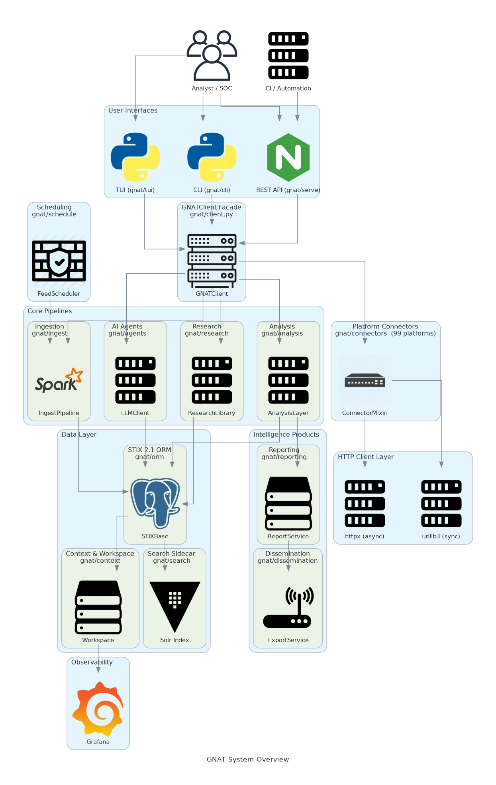
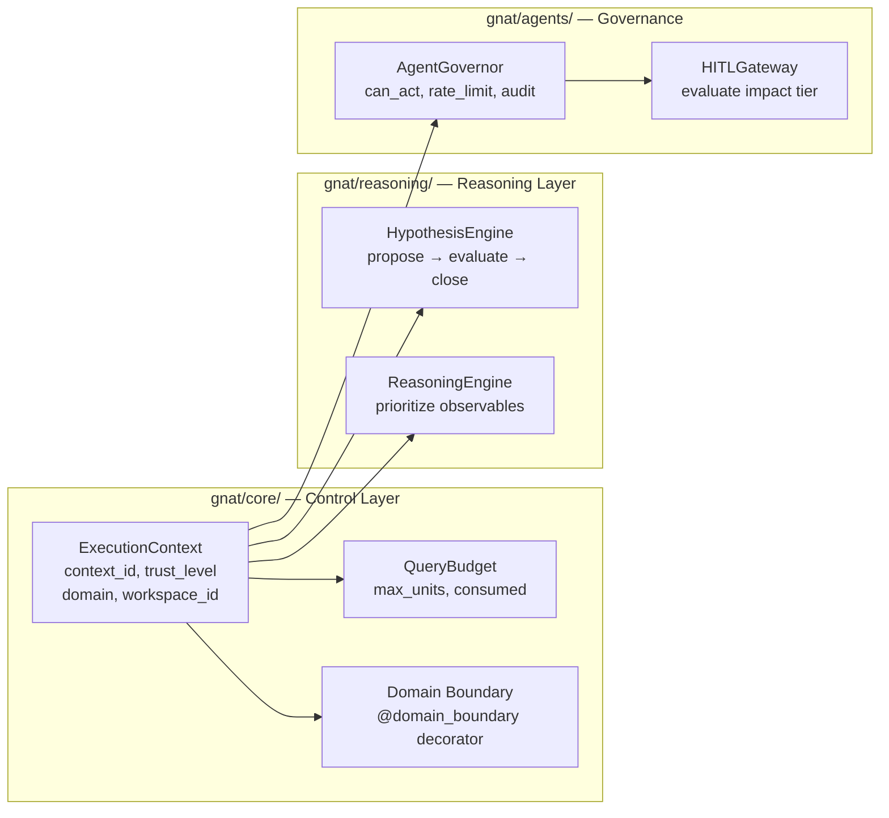
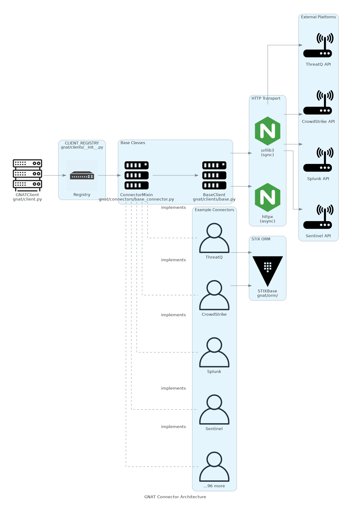
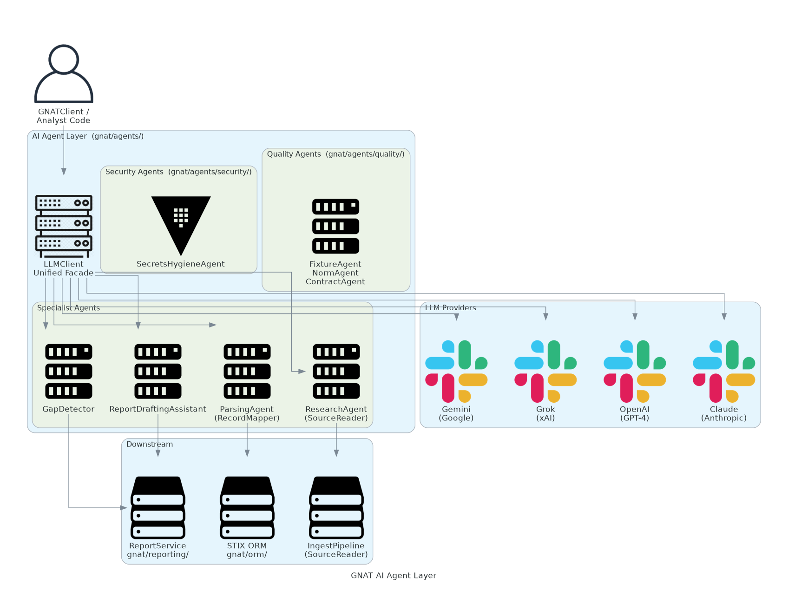
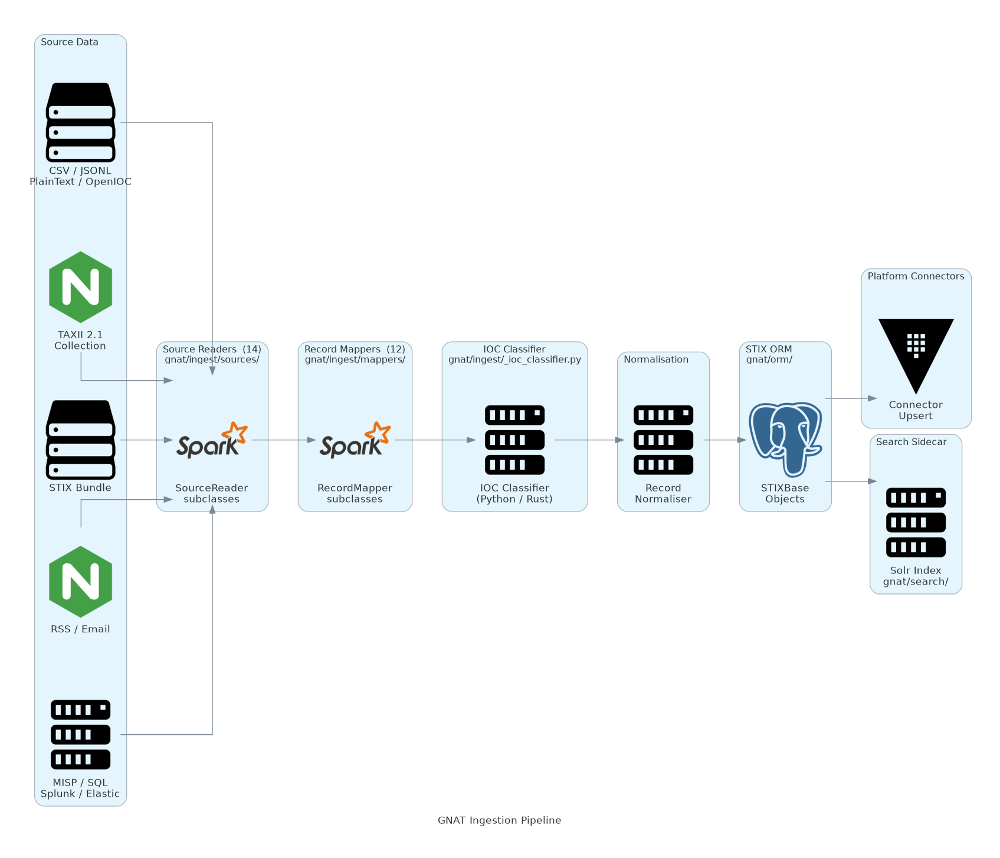

# GNAT Architectural Diagrams

This page presents the system architecture of GNAT through a set of diagrams generated
with the [`diagrams`](https://diagrams.mingrammer.com/) Python library. The source scripts
live in [`docs/_diagrams/`](../_diagrams/) and can be regenerated at any time:

```bash
python docs/_diagrams/generate_all.py
```

Diagram source files use Graphviz DOT format internally, making them compatible with
[Grafly](https://grafly.io/) for interactive editing.

---

## System Overview

The following diagram shows all major layers of GNAT and how they relate to each other.



GNAT is structured as a layered architecture:

| Layer | Package | Responsibility |
|-------|---------|---------------|
| User Interfaces | `gnat/cli/`, `gnat/tui/`, `gnat/serve/` | CLI subcommands, Textual TUI, FastAPI REST + TAXII |
| GNATClient Façade | `gnat/client.py` | Single entry point for all operations |
| **Control & Safety (Phase 4)** | **`gnat/core/`** | **ExecutionContext, Domain boundaries, QueryBudget, trust enforcement** |
| Core Pipelines | `gnat/ingest/`, `gnat/analysis/`, `gnat/agents/`, `gnat/research/` | Ingestion, analysis, AI, and research |
| **Reasoning Layer (Phase 4C)** | **`gnat/reasoning/`** | **HypothesisEngine, ReasoningEngine, evidence scoring** |
| **Agent Governance (Phase 4D)** | **`gnat/agents/governor.py`, `gnat/agents/hitl.py`** | **AgentGovernor, HITLGateway, XSOAR escalation** |
| Intelligence Products | `gnat/reporting/`, `gnat/dissemination/` | Report lifecycle, export, webhooks |
| Data Layer | `gnat/orm/`, `gnat/context/`, `gnat/search/` | STIX ORM, workspace persistence, Solr search |
| **Custom SDOs (Phase 4C)** | **`gnat/stix/sdos/`** | **STIXHypothesis, NegativeEvidenceRecord** |
| Platform Connectors | `gnat/connectors/` (159 platforms) | Bidirectional integration with external platforms |
| HTTP Client Layer | `gnat/clients/`, `gnat/async_client/` | urllib3 (sync) + httpx (async) + budget tracking |
| Scheduling | `gnat/schedule/` | Cron-based feed scheduling |
| **Testing Framework (Phase 4E)** | **`gnat/testing/`** | **SimulationConnector, ReplayRunner, AgentTestHarness** |

→ Full narrative: [`docs/architecture.md`](../../architecture.md)

---

## Phase 4 Control Layer

Phase 4 adds a **control and safety** layer that sits above all pipelines and connectors.
Every GNAT operation is now tagged with an `ExecutionContext` that carries its identity,
trust level, domain, and resource budget.



→ ADRs: [0039](adrs/0039-ADR-execution-context.md) · [0040](adrs/0040-ADR-connector-trust-model.md) · [0041](adrs/0041-ADR-idempotency-schema-evolution.md) · [0042](adrs/0042-ADR-hypothesis-engine.md) · [0043](adrs/0043-ADR-negative-evidence.md) · [0044](adrs/0044-ADR-reasoning-engine.md) · [0045](adrs/0045-ADR-agent-governance.md) · [0046](adrs/0046-ADR-hitl-gateway.md) · [0047](adrs/0047-ADR-workspace-isolation.md) · [0048](adrs/0048-ADR-query-budget.md) · [0049](adrs/0049-ADR-testing-framework.md)

---

## Connector Architecture

The diagram below illustrates how the 159 platform connectors plug into GNAT via the
`ConnectorMixin` contract and the `CLIENT_REGISTRY`.



**Key design decisions:**

- All connectors subclass `ConnectorMixin` (`gnat/connectors/base_connector.py`).
- The `CLIENT_REGISTRY` (`gnat/clients/__init__.py`) maps connector names to classes, allowing
  `GNATClient` to instantiate any connector by name from configuration.
- Network I/O is always routed through `BaseClient` (`gnat/clients/base.py`), ensuring uniform
  retry behaviour, error handling, and connection pooling.
- `to_stix()` / `from_stix()` methods on every connector provide bidirectional STIX 2.1 conversion.

→ ADR: [0003 — Connector Architecture](adrs/0003-ADR-connector-architecture.md)

---

## AI Agent Layer

The AI agent layer provides automated threat intelligence workflows powered by multiple LLM
backends through a single unified `LLMClient` façade.



**Component roles:**

| Component | Role |
|-----------|------|
| `LLMClient` | Unified façade; selects provider; automatic fallback chain |
| `ClaudeProvider` | Anthropic Claude via urllib3 (no `requests` dependency) |
| `OpenAIProvider` | OpenAI GPT via urllib3 |
| `GrokProvider` | xAI Grok via urllib3 |
| `GeminiProvider` | Google Gemini via urllib3 |
| `ResearchAgent` | Plugs in as a `SourceReader` in the ingest pipeline |
| `ParsingAgent` | Plugs in as a `RecordMapper`; extracts STIX from unstructured text |
| `ReportDraftingAssistant` | Generates AI-backed executive summaries |
| `GapDetector` | Rule-based + LLM gap analysis on investigations |

→ ADR: [0018 — AI Agent Layer](adrs/0018-ADR-ai-agent-layer.md)

---

## Ingestion Pipeline

The ingestion pipeline reads threat intelligence from 14 source types, normalises records
through 12 mappers, classifies IOCs, and writes STIX objects to the ORM.



**Pipeline stages:**

1. **Source Reader** — reads raw data (CSV, JSONL, STIX Bundle, TAXII, RSS, MISP, etc.)
2. **Record Mapper** — transforms raw records into intermediate dicts (FlatIOC, STIXPassthrough, CEF, etc.)
3. **IOC Classifier** — categorises IOCs by type (IP, domain, hash, URL, etc.); accelerated by optional Rust extension `gnat._core`
4. **Normaliser** — resolves aliases, applies TLP, fills default fields
5. **STIX ORM** — stores `STIXBase` objects in the workspace
6. **Connector Upsert** — optionally pushes normalised objects back to platform connectors
7. **Search Sidecar** — indexes objects in Solr for full-text search

→ ADR: [0004 — Ingestion Framework](adrs/0004-ADR-ingestion-framework.md)

---

## Regenerating Diagrams

The PNG files in this directory are generated artefacts. To regenerate them after updating
the source scripts:

```bash
# From the repo root
python docs/_diagrams/generate_all.py
```

Individual scripts can also be run directly:

```bash
python docs/_diagrams/generate_system_overview.py
python docs/_diagrams/generate_connector_arch.py
python docs/_diagrams/generate_ai_agents.py
python docs/_diagrams/generate_ingest_pipeline.py
```

**Dependencies:**

```bash
sudo apt-get install graphviz          # system dependency
pip install diagrams                   # Python package
```

---

*Licensed under the Apache License, Version 2.0*
