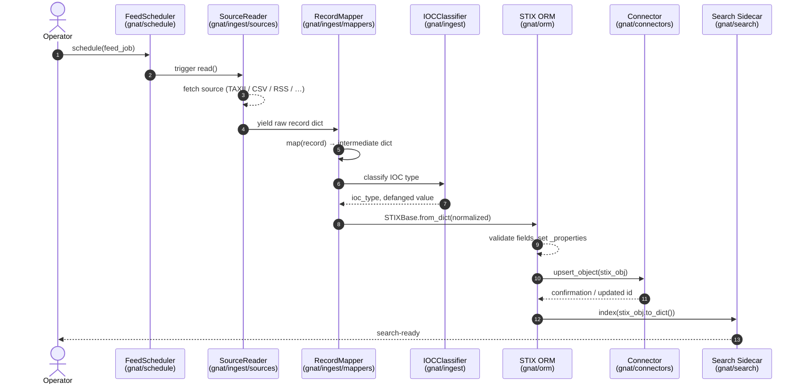
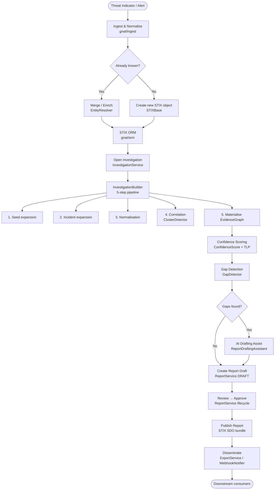
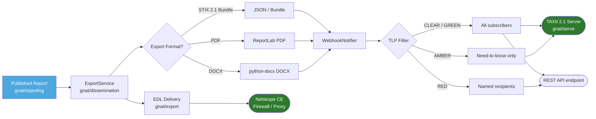
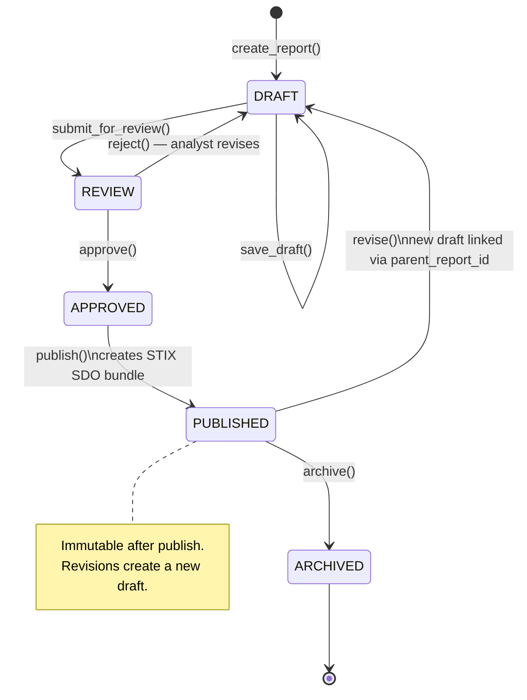
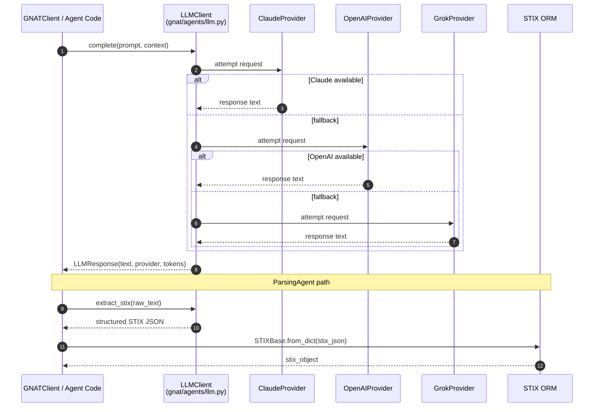
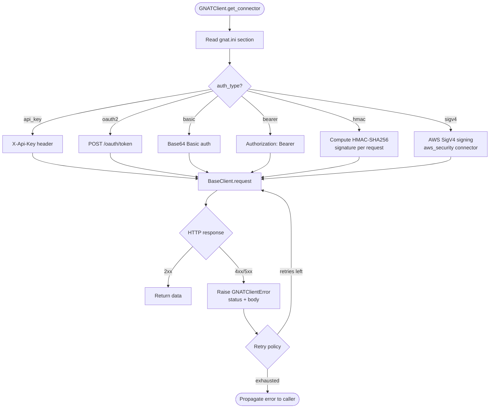

# GNAT Workflow Diagrams

This page explains the major data and control flows in GNAT through a set of workflow
diagrams. Each diagram uses [Mermaid](https://mermaid.js.org/) syntax, which renders
natively on GitHub and can be imported directly into [Grafly](https://grafly.io/) for
interactive editing.

---

## 1. Ingestion Pipeline Workflow

The following sequence diagram shows the full lifecycle of a piece of threat intelligence
as it flows through the ingestion pipeline from raw source data to a normalized STIX object
stored in a workspace.

---

## 2. Intelligence Analysis Workflow

This flow diagram shows how a SOC analyst moves from an initial threat indicator through
correlation, investigation building, and report generation to final dissemination.

---

## 3. Export & Dissemination Workflow

---

## 4. Report Lifecycle State Machine

---

## 5. AI Agent Request Flow

---

## 6. Connector Authentication Flow

---

## 7. Feed Scheduling Workflow

---

## Using These Diagrams

All Mermaid diagrams in this file can be:

- **Rendered directly on GitHub** — GitHub renders Mermaid in Markdown automatically.
- **Imported into [Grafly](https://grafly.io/)** — copy the Mermaid code block and use
  *File → Import → Mermaid* in the Grafly editor.
- **Embedded in Sphinx docs** — add `sphinxcontrib-mermaid` to `docs/sphinx-html/requirements.txt`
  and the extension to `conf.py`, then use the `.. mermaid::` directive.

---

*Licensed under the Apache License, Version 2.0*
